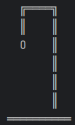
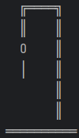
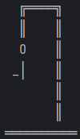
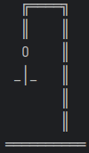
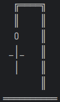
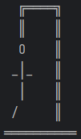
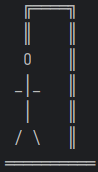

# Desarrollo de un juego de ahorcado

## 1. Descripción del juego
El Ahorcado es un juego en el que un jugador debe adivinar una palabra antes
de que se acaben sus turnos.

Al ejecutar la aplicación, el jugador tiene la opción de iniciar un nuevo juego o salir. 
Cuando inicia un nuevo juego, el sistema le presenta la palabra secreta mostrando solo 
guiones que corresponden a cada letra de la palabra, pero antes reinicia el estado del 
sistema (en caso de que hubiera un juego antes), limpiando la lista de letras usadas y 
volviendo el número de intentos a cero.

El jugador ingresa una letra que crea que hace parte de la palabra. Si la letra hace parte de la palabra,
el sistema le indica las posiciones de la palabra en la que está la letra y le va mostrando una lista de
las letras que ya ha usado. Si la letra no se encuentra en la palabra, el sistema le muestra la figura 
del ahorcado, la cual se va a ir construyendo a medida que el usuario vaya fallando un intento, tal como
lo muestra la siguiente tabla:

|        Imagen Ahorcado        | Intento |
|:-----------------------------:|:-------:|
|  |    1    |
|  |    2    |
|  |    3    |
|  |    4    |
|  |    5    |
|  |    6    |
|  |    7    |

Si en 7 intentos el usuario no logra descubrir la palabra, pierde el juego y el sistema le indica cual era
la palabra secreta. Si el usuario descubre la palabra antes de 7 intentos fallidos, el sistema le indica que
ha ganado. En cualquiera de los dos casos, el sistema le vuelve a presentar el menú inicial al jugador
para que este decida si quiere iniciar un nuevo juego o salir de la aplicación.
